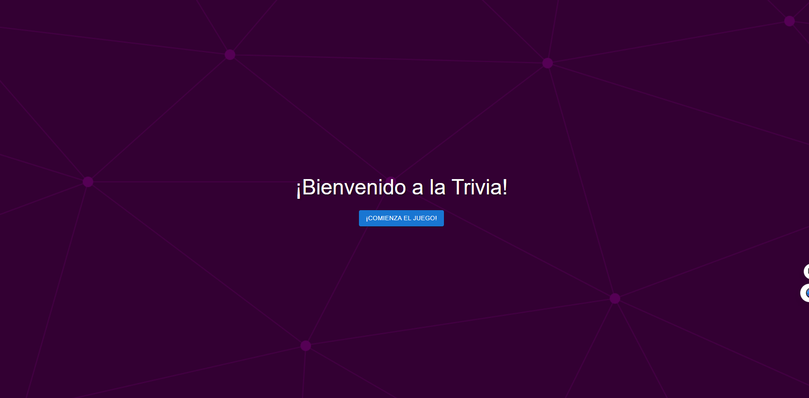
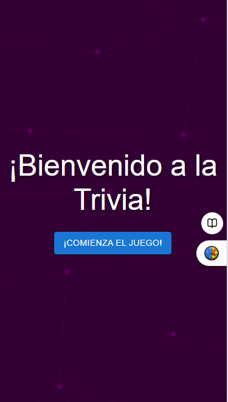
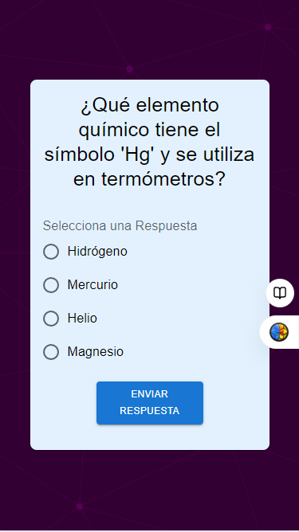
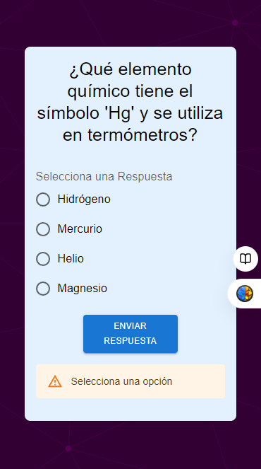
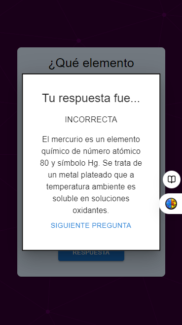
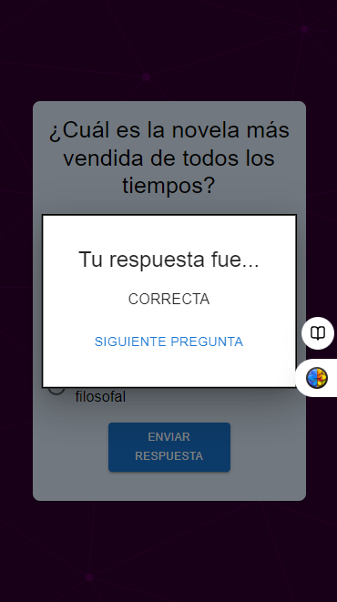
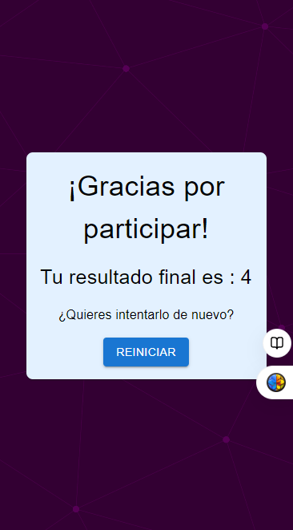

# Trivia

Esta app [Triva](https://triviaada.netlify.app) es un juego de preguntas donde el usuario por cada pregunta correcta suma un punto.

## La vista segun el tamaño:

Modo celular:

Modo desktop:

## Modo de uso:

- Una pantalla inicial con un botón para empezar el juego, allí se ve un botón de comienza el juego al tocar lleva al usuario a la primera pregunta de la trivia.

- Muestra una pregunta a la vez con cuatro opciones de respuesta.
- Permite al usuario seleccionar una respuesta.
- Si se toca el botón de enviar respuesta sin tocar una opción saldrá el aviso de seleciona una opción

- Mustra feedback inmediato sobre si la respuesta es correcta o incorrecta.

- Pasa a la siguiente pregunta después de mostrar el feedback y tocar el siguiente pregunta.

### Puntuación Final:

- Mustra la puntuación total obtenida al final del juego.
- Además permite volver a intentarlo si asi se desea

## Construido Con:

Las tecnologías que se utilizo para construir este proyecto:

- JavaScript
- React
- Material-UI (MUI)

## Link al deploy

https://triviaada.netlify.app
